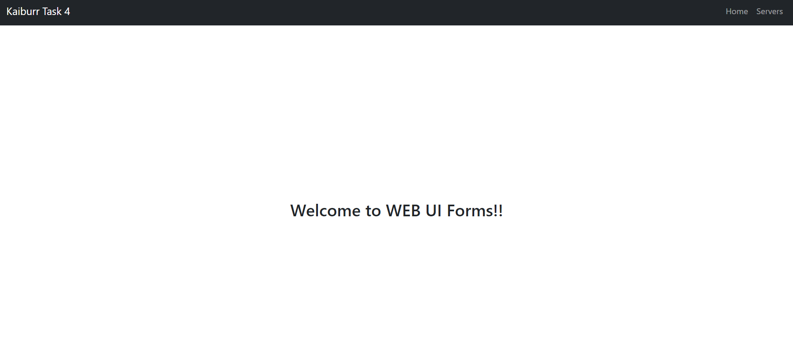
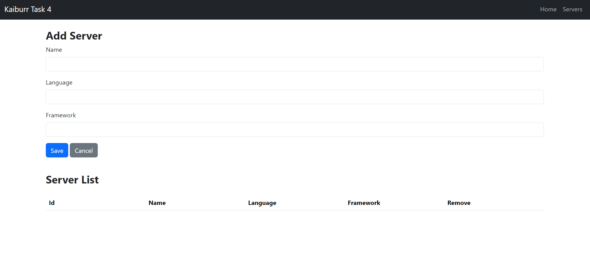
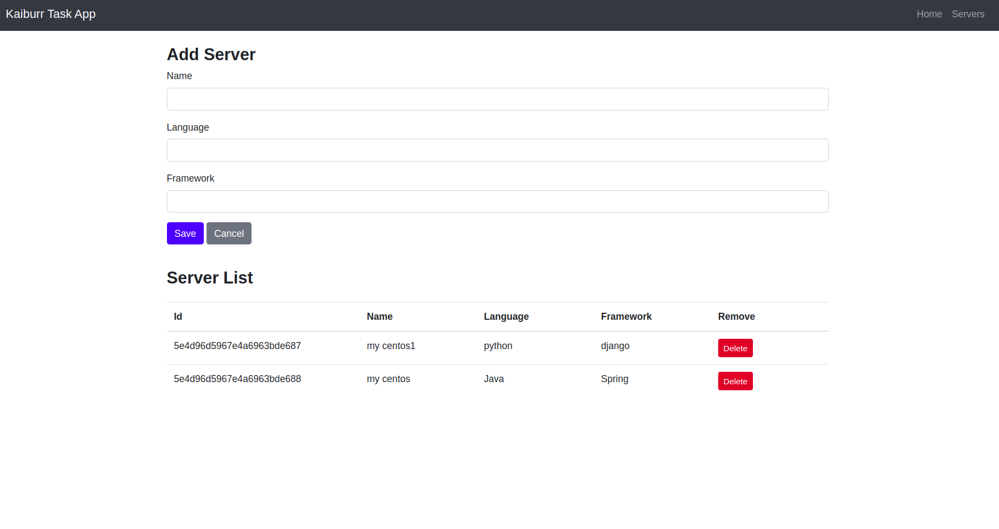

# Task 4: Web UI forms

This repository contains a basic web user interface (UI) frontend for an application that provides a REST API for managing "server" objects. The REST API is implemented in Java and uses MongoDB as the database for storing server objects. The web UI allows users to interact with the API by performing actions such as searching, creating, and deleting server records.

## Screenshots

Here are some screenshots of the web UI:

### Home Page


### Server Form


### Servers


## Features

- **GET Servers**: Retrieves all server records from the database. If no parameters are passed, it returns all servers. When a server ID is passed as a parameter, it returns a single server or a 404 error if the server does not exist.

- **PUT a Server**: Allows users to create a new server by providing the server details as a JSON-encoded message body. Example JSON structure:
  ```json
  {
    "name": "my centos",
    "id": "123",
    "language": "java",
    "framework": "django"
  }
  ```

- **DELETE a Server**: Deletes a server record based on the server ID provided as a parameter.

- **GET (Find) Servers by Name**: Searches for server records that contain the provided string in their names. It returns one or more servers found or a 404 error if nothing is found.

## Prerequisites

Before running the web UI, make sure you have the following dependencies installed:

- Java (JDK 8 or higher)
- MongoDB
- Any UI framework of your choice (e.g., React, Angular, Vue.js)

## Installation and Usage

1. **Clone this repository** to your local machine.

2. **Configure the Java REST API**:
   - Ensure that the Java REST API is up and running with the MongoDB database properly configured. You can refer to the documentation of the Java REST API project for setup instructions.

3. **Configure the Web UI**:
   - Install the required dependencies for your chosen UI framework.
   - Update the API endpoint URL in the UI code to point to your Java REST API.

4. **Run the Web UI**:
   - Start the web UI application using the appropriate commands for your chosen UI framework.

5. **Access the Web UI**:
   - Open a web browser and navigate to the URL where the web UI is running (e.g., http://localhost:3000).

6. **Use the Web UI to interact with the Java REST API**:
   - You should be able to create, show, and delete server records from the UI.

## Testing with Postman or Curl

To test how the application responds to requests using Postman, Curl, or any other HTTP client, follow these steps:

1. Open your preferred HTTP client tool.

2. Make HTTP requests to the appropriate API endpoints of the Java REST API, as described in the API documentation.

3. Observe the responses and ensure that the Java REST API functions correctly.

